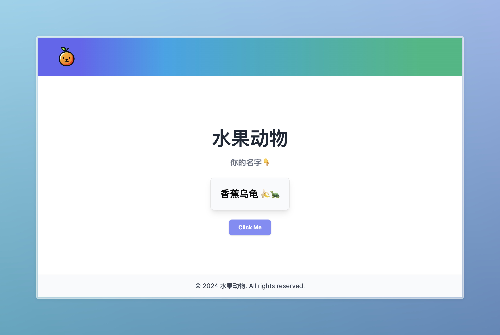

# 水果动物 🍇🐒 - Nickname Generator

水果动物 (Fruit Animal) is a fun and playful web application that generates random nicknames combining fruits and animals. The application uses a minimalistic and modern UI, inspired by popular design patterns, and provides a smooth user experience.

## Show Case



## Installation

To run this project locally, follow the steps below:

1. **Clone the repository**:

   ```bash
   git clone https://github.com/yourusername/fruit-animal-nickname-generator.git
   cd fruit-animal-nickname-generator
   ```

2. **Install dependencies**:

   Navigate to the `frontend` directory and install the necessary dependencies using npm:

   ```bash
   cd frontend
   npm install
   ```

3. **Start the frontend**:

   After installing the dependencies, start the development server:

   ```bash
   npm run dev
   ```

4. **Start the backend**:

   Navigate to the `backend` directory, activate your Python virtual environment, install the necessary packages, and start the FastAPI server:

   ```bash
   cd backend
   python -m venv venv
   source venv/bin/activate
   pip install -r requirements.txt
   uvicorn main:app --reload
   ```

5. **Access the application**:

   Once both the frontend and backend servers are running, you can access the application by navigating to `http://localhost:3000` in your web browser.

## Project Structure

```txt
fruit-animal-nickname-generator/
├── backend/               # FastAPI backend
│   ├── main.py            # Main application file
│   ├── fruits.txt         # List of fruits
│   ├── animals.txt        # List of animals
│   └── requirements.txt   # Python dependencies
├── frontend/              # React frontend
│   ├── public/            # Public assets (e.g., logo)
│   ├── src/               # Source code
│   │   ├── components/    # UI components
│   │   ├── pages/         # Page components
│   │   ├── styles/        # Stylesheets
│   │   ├── App.js         # Main application component
│   │   └── index.js       # Entry point
│   ├── package.json       # NPM dependencies
│   └── tailwind.config.js # Tailwind CSS configuration
└── README.md              # Project documentation
```

## Technologies Used

- **Frontend**:
  - React
  - Tailwind CSS
  - Shadcn UI

- **Backend**:
  - FastAPI (Python)
  - Uvicorn

## Contributing

Contributions are welcome! Please fork this repository and submit a pull request with your changes.

## License

This project is licensed under the MIT License.
